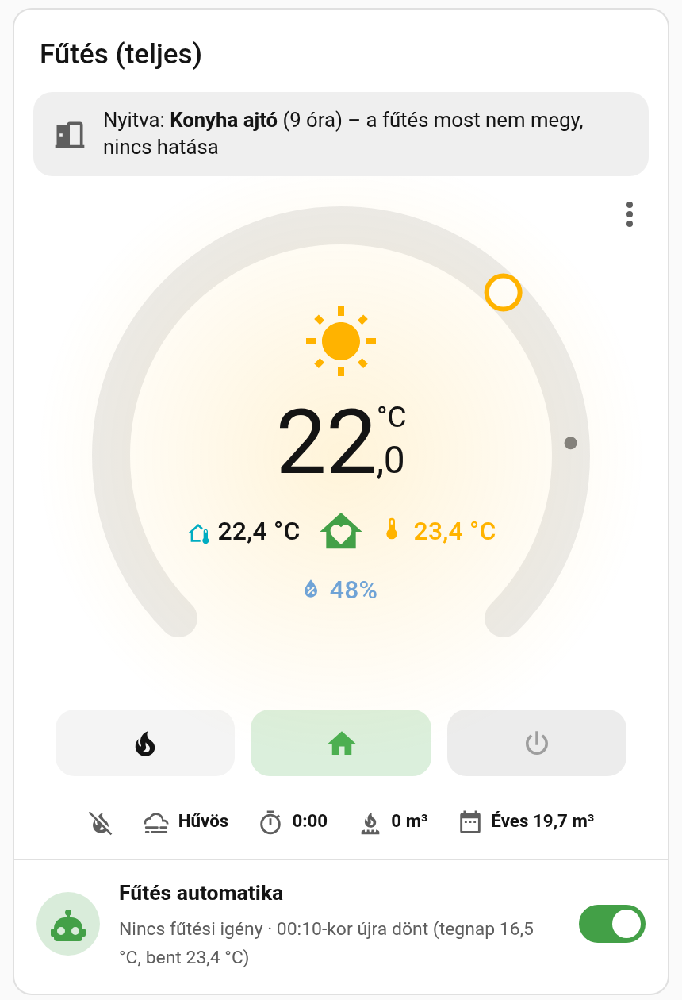

# Fűtésvezérlés Home Assistanthoz (magyar)

Egy valós, gázkazános, radiátoros otthoni fűtésrendszerből általánosított csomag. A részek egymástól függetlenül is használhatók.

| Rész | Mit csinál |
|---|---|
| **Fűtésvezérlő blueprint** | Hat, egyenként bekapcsolható szekció: éjszakai visszavétel, távollét, napi be/ki döntés hiszterézissel, évszakonkénti PID-hangolás (Smart Thermostat), kazánhiba-figyelő magától törlődő jelzővel, ablak/ajtó-figyelembevétel |
| **Jelenlét alapú preset blueprint** | Otthon / Távol / Szabadság szerint vált presetet (fűtés, klíma), éjjel az éjszakai presettel érkezik |
| **Háztartás-jelenlét csomag** | `sensor.haztartas_jelenlet`: Otthon / Távol / Szabadság (12 óra után) az összes `person` entitásból, beállítás nélkül. A zóna („Munkahely”) is távollétnek számít. |
| **Kazán csomag** | tényleges fűtés (relé és fogyasztás), napi fűtési idő, **gázfogyasztás-becslés gázmérő nélkül**, benti hőmérséklet-trend, kazánhiba-jelző, automatika-kapcsoló, évszak-sáv |
| **Termosztát-kártya** (`hu-futes-card`, `hu-klima-card`) | a Better Thermostat UI tárcsáját egészíti ki: ablak-sáv, ikonsor, kinti hő és jelenlét a tárcsában, villogó hibajelzés, nyári pihenő (napocska), automatika-sor, ⋮ menü |



> [!WARNING]
> **Biztonság.** A fűtésvezérlés a kazán saját védelmeit (lángőr, túlhevülés-védelem stb.) nem helyettesíti. Érdemes egy **Home Assistanttól független tartalékot** is tartani, például egy hagyományos szobatermosztátot alacsony hőfokra (pl. 16 °C) párhuzamosan kötve, ha a HA vagy egy érzékelő kiesik.
> **A gázfogyasztás becslés**, nem mérés: az égési idő × a kazán névleges teljesítménye alapján. A moduláló kazán valós fogyasztása ennél kevesebb is lehet. A számlázás alapja mindig a gázóra.
> A csomagot saját felelősségre használd, garancia nélkül (MIT licenc).

---

## Követelmények

- **Home Assistant 2025.10 vagy újabb.**
- Egy **climate** entitás presetekkel (`home`, `sleep`, `away`, `eco` …), például:
  - [Smart Thermostat (PID)](https://github.com/ScratMan/HASmartThermostat) (HACS) – a PID-hangoló szekcióhoz ez kell. Példa-beállítás: [docs/pelda_smart_thermostat.yaml](docs/pelda_smart_thermostat.yaml);
  - vagy a beépített `generic_thermostat` presetekkel, vagy a [Better Thermostat](https://github.com/KartoffelToby/better_thermostat).
- **A kártyához:** HACS → [Better Thermostat UI](https://github.com/KartoffelToby/better-thermostat-ui-card) kártya.
- **Ablaknyitásnál a fűtés leállításához** (nem része a csomagnak, mert van rá jó közösségi blueprint): keresd a Blueprint Exchange-en a „Window open, climate off” (SmartLiving.Rocks) blueprintet.

## Telepítés

### 1. Blueprintek

[](https://my.home-assistant.io/redirect/blueprint_import/?blueprint_url=https%3A%2F%2Fgithub.com%2FGyuszko55%2Fha-futes-hu%2Fblob%2Fmain%2Fblueprints%2Fautomation%2Fhu_futes%2Ffutesvezerles.yaml)
**Fűtésvezérlés**

[](https://my.home-assistant.io/redirect/blueprint_import/?blueprint_url=https%3A%2F%2Fgithub.com%2FGyuszko55%2Fha-futes-hu%2Fblob%2Fmain%2Fblueprints%2Fautomation%2Fhu_futes%2Fjelenlet_preset.yaml)
**Jelenlét alapú preset**

Vagy kézzel: Beállítások → Automatizálások és jelenetek → Blueprintek → **Blueprint importálása**, és illeszd be a fájl GitHub-címét.

### 2. Csomagok (jelenlét és kazán)

Másold a `packages/futes/` mappát a Home Assistant `config/packages/` mappájába. A `configuration.yaml`-ban legyen benne:

```yaml
homeassistant:
  packages: !include_dir_named packages
```

Terminálból (Terminal & SSH add-on):

```sh
cd /config && curl -sL https://github.com/Gyuszko55/ha-futes-hu/archive/refs/heads/main.tar.gz \
  | tar xz --strip-components=1 --wildcards '*/packages/*' '*/www/*'
```

Utána: Fejlesztői eszközök → YAML → **Konfiguráció ellenőrzése**, majd **Újraindítás**.

**Beállítás a felületen** (Beállítások → Eszközök és szolgáltatások → Segédek):

| Segéd | Mit írj be |
|---|---|
| Kazán – relé/kapcsoló | a kazánt kapcsoló entitás, pl. `switch.kazan_rele` |
| Kazán – teljesítmény-szenzor | *nem kötelező.* A kazán elektromos fogyasztása (W). Ha megadod, csak a küszöb fölötti fogyasztás számít tényleges fűtésnek. |
| Kazán – fűtés küszöb | pl. 10 W |
| Kazán – névleges teljesítmény | a kazán adattábláján szereplő kW (0 = nincs gázbecslés) |
| Gáz fűtőértéke | kWh/m³ (0 = 9,5) |
| Fűtés – benti hőmérő | a nappali hőmérője (a trendhez) |
| Jelenlét – kizárt személyek | pl. `person.vendeg` (vesszővel elválasztva) |
| Szabadság küszöb | óra (0 = 12) |

Létrejövő entitások:
- `binary_sensor.kazan_tenylegesen_fut`
- `sensor.kazan_futesi_ido` (óra)
- `sensor.kazan_gaz_napi` és `sensor.kazan_gaz_osszesen` (m³). Ez utóbbi az Energia irányítópulthoz gázforrásként is megadható.
- `sensor.futes_benti_trend` (°C/óra)
- `sensor.haztartas_jelenlet`
- `input_boolean.futes_auto`, `input_boolean.kazan_hiba`, `input_select.futes_evszak`

### 3. Blueprint-példányok

**Fűtésvezérlés:** Automatizálások → Új → Blueprintből → *Fűtésvezérlés*.

- **Termosztát:** a te climate entitásod.
- **Fő kapcsoló:** `input_boolean.futes_auto`.
- Kapcsold be a kívánt szekciókat, és add meg a szenzoraikat. Ami ki van kapcsolva, annak a mezői üresen hagyhatók.
- **Kazánfelügyelethez:**
  - „Ténylegesen fűt”: `binary_sensor.kazan_tenylegesen_fut`;
  - trend: `sensor.futes_benti_trend`;
  - hibajelző: `input_boolean.kazan_hiba`.
- **PID-hangoláshoz:** szezon-kijelző `input_select.futes_evszak`. A sávok nevei: Hideg / Hűvös / Enyhe.

**Jelenlét alapú preset:** termosztátonként egy példány, engedélyezőnek pl. `input_boolean.futes_auto`. Ha ezt használod, a Fűtésvezérlés 2. szekcióját (távollét) hagyd kikapcsolva.

### 4. Kártya

1. Másold a `www/hu-termosztat/hu-termosztat.js` fájlt a `config/www/hu-termosztat/` mappába. A fenti terminálparancs ezt is megcsinálja.
2. Beállítások → Irányítópultok → ⋮ → **Erőforrások** → hozzáadás:
   - URL: `/local/hu-termosztat/hu-termosztat.js?v=1`
   - Típus: **JavaScript modul**

   Ha nem látod az Erőforrásokat, a profilodban kapcsold be a Haladó módot.
3. Kártya hozzáadása → Kézi kártya:

```yaml
type: custom:hu-futes-card
entity: climate.futes
outdoor_entity: sensor.kulso_homerseklet
opening:
  sensor: binary_sensor.ablakok_ajtok
```

Az összes beállítás magyarázattal: [dashboard/kartya_peldak.yaml](dashboard/kartya_peldak.yaml). Frissítés után a `?v=` számot emeld meg, hogy a böngésző ne a régit használja.

---

## Hogyan működik

Részletes leírás: [docs/HASZNALAT.md](docs/HASZNALAT.md). Szerepel benne a szekciók működése, a kártya jelzései, a gázbecslés pontosítása és a hibaelhárítás.

## Licenc

MIT, garancia nélkül. Lásd a figyelmeztetést fent.
